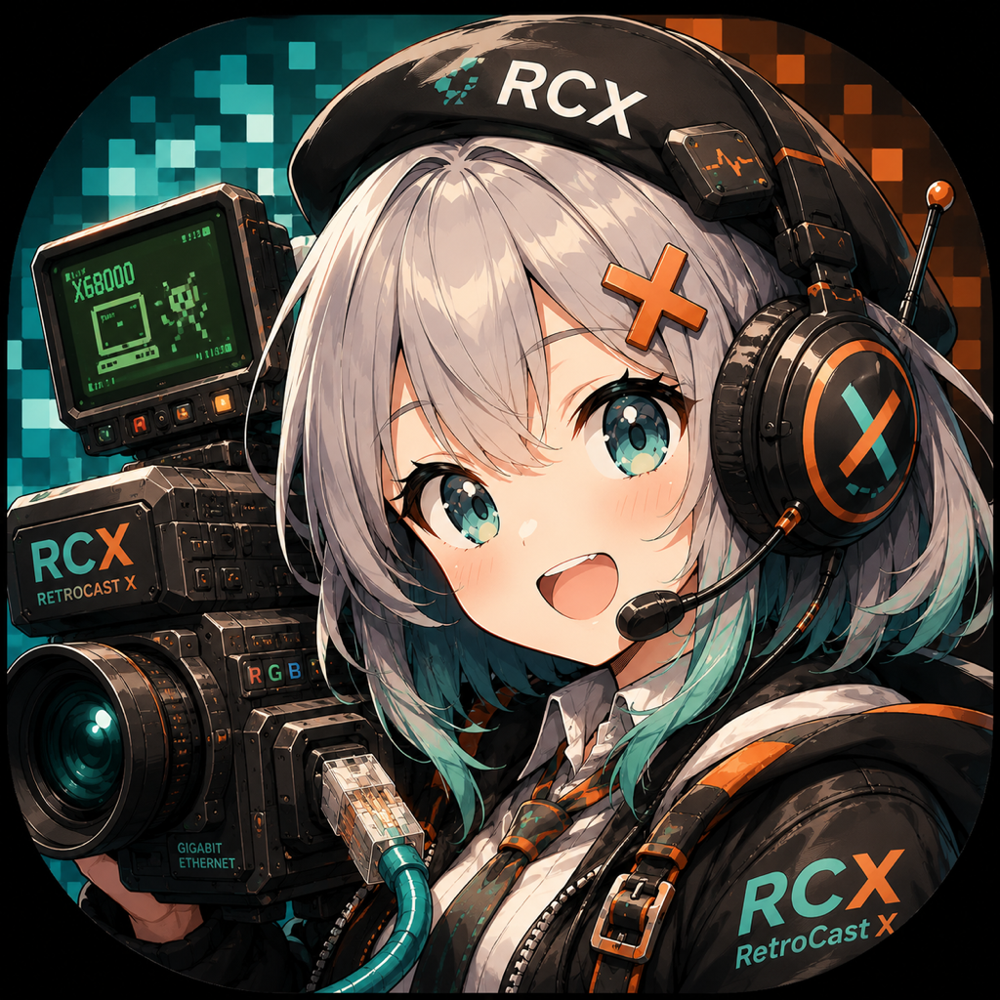

# RetroCastX



レトロPC(X68000 / PC-98 など)のアナログRGB信号を、フレームバッファレスで PC/Mac に伝送・表示するプロジェクト。

```
Retro PC ──アナログRGB──▶ ADC(TVP7002) ──24bit+PCLK──▶ FPGA(ECP5) ──UDP/GbE──▶ PC/Mac(再構成・表示)
```

## 設計思想

一般的なアップスキャンコンバータは変換器内でフレームバッファを構築し標準的なHDMI信号に整形するため、
機種固有のタイミング情報が失われ、遅延・モード切替時のブラックアウト・価格の問題が生じる。

RetroCastX は「変換器は馬鹿に徹し、知性はPC側に置く」:

- ADC でドットクロックを再生してサンプリングした**生のピクセルデータを、タイミング情報ごと**
  「1パケット≒1ライン」の UDP で送出する(FPGA はラインFIFO程度しか持たない)
- フレームの再構成・スケーリング・表示は PC/Mac 側で行う

これにより:

- **生タイミング保存**: VRR対応モニタなら 55.46Hz(X68000)等の非標準リフレッシュをそのまま表示可能
- **モード切替の無切断追従**: ゲーム中の解像度切替もヘッダ通知で追従
- **真のロスレス**: 8bit で取得し PC 側でパレット吸着(X68000 は本来 RGB 各5bit)
- **低遅延**: サブフレーム(ライン単位)伝送
- **安価**: フレームバッファ用メモリも高度な画像処理も変換器側に不要

## リポジトリ構成

```
docs/
  protocol-v0.md    伝送プロトコル仕様 v0(ドラフト)
  research/         部品・ボード調査レポート
gateware/           FPGA側(LiteX / Colorlight i5)※sim検証済み、実機未検証
hardware/           ADCフロントエンド基板(Atopile、HAT形式)
host/python/        PC側リファレンス実装(送信シミュレータ・受信・検証)
client/             ビューアアプリ(Rust + eframe/egui、Mac/Win/Linux)
```

## クイックスタート(ハードウェア不要)

送信シミュレータと受信器をループバックで動かす:

```sh
cd host/python
python3 -m retrocastx.tests.test_loopback   # プロトコルのE2E検証
python3 -m retrocastx.tests.test_videoin    # コンポジットの波形解析(合成波形で検証)
python3 -m retrocastx.tests.test_ntsc       # NTSC復調(合成6色で真値と照合)
python3 -m retrocastx.sender_sim &          # テストパターンをUDP送出
python3 -m retrocastx.receiver --dump out   # 受信して out/frame_NNNN.ppm に保存
```

## ハードウェア(フェーズ1〜2 想定)

| 役割 | 部品 | 備考 |
|---|---|---|
| FPGAボード | Colorlight i5 + 拡張基板 | ECP5-25F、GbE PHY ×2、SODIMM I/O 直結 |
| ADC | TI TVP7002 | OSSC と同一。15/24/31kHz 実証済み。ブレークアウト自作 |
| 参考回路 | [marqs85/ossc_pcb](https://github.com/marqs85/ossc_pcb) | アナログ入力段・TVP7002 周辺 |

調査の詳細は `docs/research/2026-07-25-hardware-survey.md` を参照。

## ステータス

- [x] 構想・部品調査
- [x] プロトコル v0 ドラフト(映像 LINE/MODE + 音声 AUDIO + 発見/購読 + CONFIG)
- [x] PC側リファレンス実装(シミュレータ + 受信器)
- [x] LiteX ゲートウェア step2(テストパターン送出+購読) — sim検証・ビットストリーム生成済み
- [x] TVP7002 ブレークアウト設計(音声3系統・ArgusX制御含む、電気設計検証まで)
- [x] ビューアアプリ雛形(Rust + eframe、sender_sim相手にE2E確認済み)
- [ ] ゲートウェア実機動作(ボード入手待ち)
- [ ] 基板発注(atopile部品API復旧後にフットプリント紐付け)
- [ ] 音声キャプチャ(gateware step4)・音声再生(client)
- [ ] 実機キャプチャ(X68000 / PC-98)

## ライセンス

ディレクトリごとに異なります。

| 対象 | ライセンス |
|---|---|
| `gateware/` `client/` `host/` | [Apache License 2.0](LICENSE) |
| `hardware/` | [CERN-OHL-S-2.0](hardware/LICENSE)(強い相互性のオープンハードウェアライセンス) |
| `docs/` | [CC BY-SA 4.0](docs/LICENSE) |

`hardware/` の CERN-OHL-S-2.0 は、**この設計を元に製品を作って頒布・販売する場合、
改変を含む設計一式(Complete Source)を公開し、製品または同梱文書に入手先を明記する**
ことを求めます。個人が自分用に作る分にはこの義務は発生しません。

ライセンスの対象外となるファイル(部品メーカーのデータシート、ベンダー由来の
KiCad シンボル・フットプリント等)については [NOTICE](NOTICE) を参照してください。

### 商標

**"RetroCast X"**(正式名称)および **"RetroCastX"**(ファイル名・識別子・
ハッシュタグ等で用いる短縮形)の名称、ロゴ、アイコン、基板シルク上のブランド
表記は、上記いずれのライセンスの許諾範囲にも含まれません
(Apache License 2.0 第6条)。空白の有無・大文字小文字の違いを問いません。

フォークや派生ハードウェアを頒布する場合は、別の名称を用いてください。

### ハードウェアの製造を検討されている方へ

本設計に基づくハードウェアの製造・頒布を計画されている場合、事前にご一報
いただけると嬉しいです。**ライセンス上の義務ではありません**が、既知の問題や
実装上の落とし穴を共有できますし、改善を上流に取り込める場合もあります。

## コントリビューション

歓迎します。手順と DCO(Signed-off-by)については [CONTRIBUTING.md](CONTRIBUTING.md)
を参照してください。特に**手元の実機での動作報告**が助かります。
